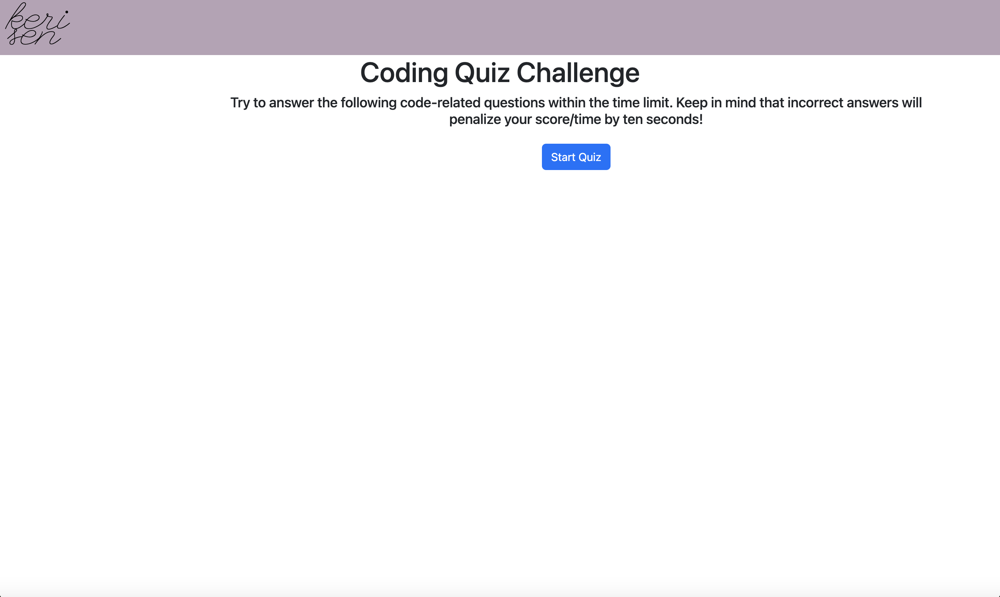
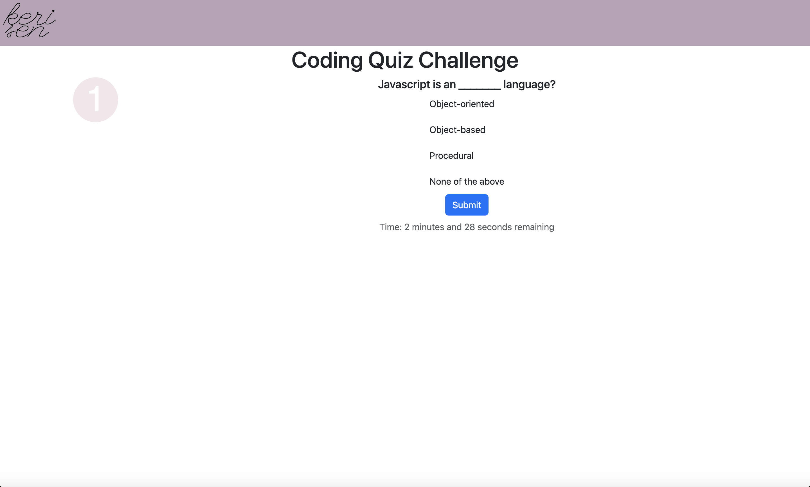
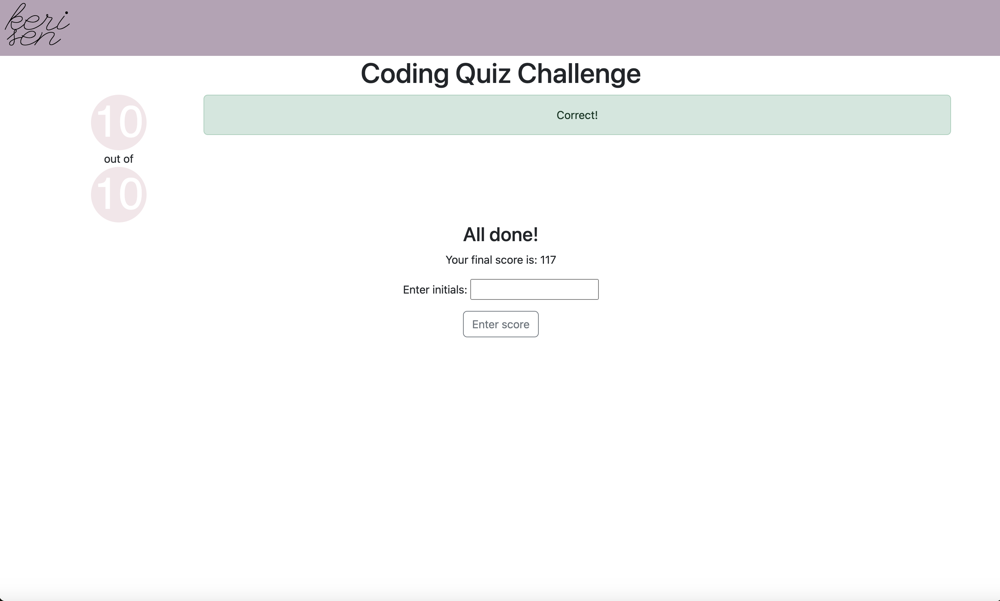

# Coding Quiz

## Description

This is a timed quiz on JavaScript fundamentals that stores high scores. The user is given a time limit to complete the quiz and each wrong answer gives a time penalty. The final score is determined by the time left on the clock when you finish. It pulls questions and answers from a JSON file so that it can potentially be customized for different subjects, skill levels or length. 

One challenge I faced was getting the formatting of the JSON file right and figuring out how to load and parse it. I'm eager to learn more advanced database applications. An improvement I would like to make is a more sophisticated scoring algorithm that takes the number of correct answers into account as well as the time remaining. If someone is slow to answer all questions correctly, they could potentially end up with the same score as someone who very quickly gets all or mostly wrong answers.

## Installation

N/A

## Usage

Live URL: (https://kerilsen.github.io/code-quiz)

Load the page and click on the "Start Quiz" button.

 You will be guided through a series of questions in which you must select an answer and hit "Submit" to continue to the next. You will be shown a message that gives you feedback on your answer after you hit 
"Submit". 

At the end of the game, you are given your score (which is the remainder of the time left when you finished - including any penalties) and the number of questions you got right (which has no impact on your score).

Finally, you are given the option to submit your initials to the high score list. The high scores are stored in local storage and dynamically added for display to the user.

## Credits

N/A

## License

Please refer to the LICENSE in the repo.